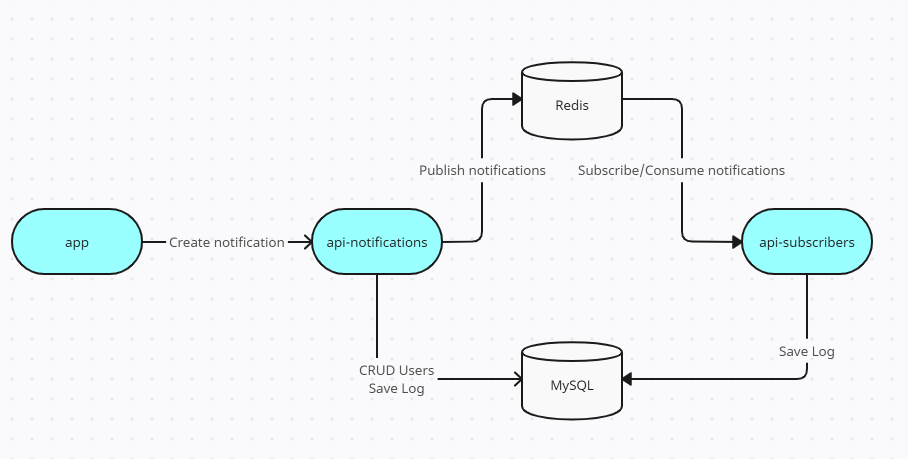
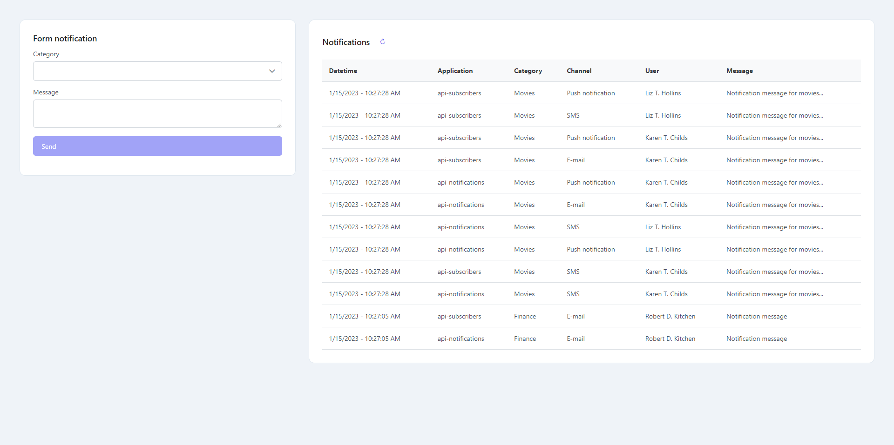

# Notifications using NestJS

## Overview

*First of all, I used Redis in this example.
**Redis** is an in-memory data structure store, used as a database, cache, and message broker.
Because of this is applicable for some scenarios.
If you need a persistent database, see **RabbitMQ** and/or **Kafka**.*

This project was made for use **Observer pattern**, also known as: Event-Subscriber, Listener.

Repositories:

- [api-notifications](api-notifications): API Restfull developed using **NestJS** responsible for the notifications
  endpoint and CRUD of users.
- [api-subscribers](api-subscribers): Microservice developed using **NestJS** responsible for consume the messages.
- [app](app): Frontend developed using **VueJS** with PrimeVue.

Screen of UI for generate and see the notifications.

## Running

### Using docker

#### Requirements

- Docker version 20+
- Docker Compose version v2+

#### Steps

- Clone the project;
- In the root folder (node-pubsub) run **docker-compose up -d**
- After some minutes access the url http://localhost:8000/

### Using npm

### Requirements

- Node v16+

#### Steps

*Obs.: There are two services in the docker that you can use. MySQL and Redis.
It's simple to use, comment the services' app, api-notifications, api-subscribers and **run docker-compose up -d**.
Or you can change the variables (.env) for appoint for your local MySQL and Redis.*

- Clone the project;
- In the root folder execute **cd api-notifications**;
- Rename .env.example to .env
- **npm install**
- **npm run migration:run**
- **npm run start:dev**

- In the root folder execute **cd api-subscribers**;
- Rename .env.example to .env
- **npm install**
- **npm run start:dev**

- In the root folder execute **cd app**;
- **npm install**
- **npm run dev**

## Next steps

- Implement tests;
- Implement test containers;
- Create screen for manipulate users;
- Implement healthcheck in services;